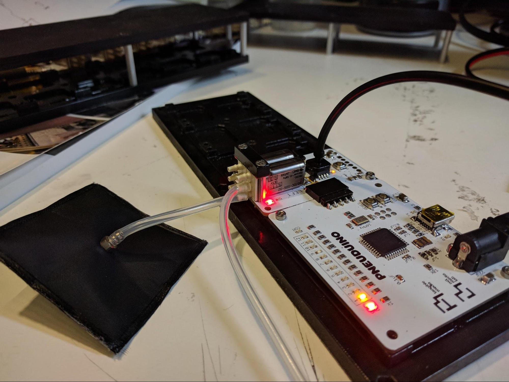

## NOT Gate
**Boards:** Master and valve board 
**Tube connections:** Connect tubes as shown below

 

The NOT gate is a logic gate that takes one input. It outputs a `true` when the input is `false` and outputs a `false` when the input is `true`. With pneumatic logic, a high pressure indicates `true` and a low pressure indicates `false`. As Pneuduino valve boards have pressure sensors, they can be programmed to open and close valves depending on an applied pressure. With the right code and tube connections, we can implement pneumatic logic gates.

For the NOT gate, connect the logic input to the pressure sensor (black tube in the above image). Connect the left valve's supply port to a source of compressed air. Connect the left valve's output to the inflatable. When no pressure is applied to the input, the output will be `true`, and the inflatable will inflate. Conversely, when the input is connected to pressurized air, the inflatable will deflate.

