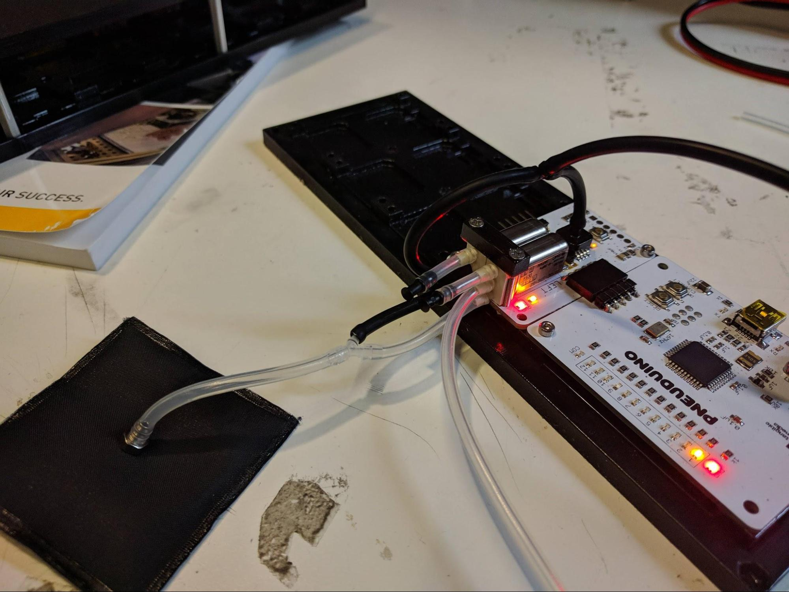

## OR Gate
**Boards:** Master and valve board 
**Tube connections:** Connect tubes as shown below

 

The OR gate is a logic gate that takes two inputs, A and B. It outputs a `true` when at least one of A and B are `true`. With pneumatic logic, a high pressure indicates `true` and a low pressure indicates `false`. As Pneuduino valve boards have pressure sensors, they can be programmed to open and close valves depending on an applied pressure. With the right code and tube connections, we can implement pneumatic logic gates.

For the OR gate, connect input A to the supply port of the left valve (bottom clear tube in the above image). Using a T connector, connect input B to both the pressure sensor and the supply port on the right valve. (upper black tubes in the image). Using a Y connector, connect the output ports of both valves to the inflatable. Plug the exhaust ports of both valves using a short length of tubing and a stopper. Run the code, and connect any one (or both) of the inputs to pressurized air. The output will be `true`, and air will be sent to the inflatable.

