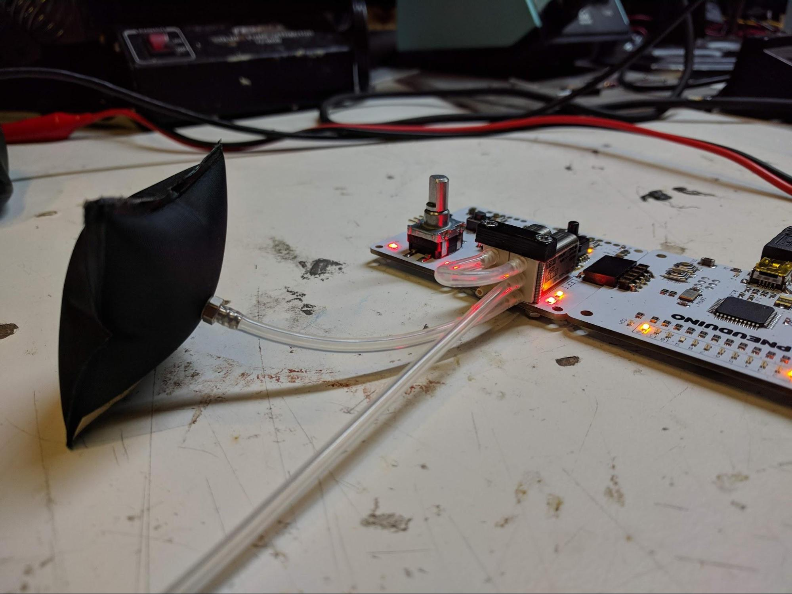

## 05 Three-state Operation
**Boards:** Master, valve board, and input board 
**Tube connections:** Connect the valves as shown below

 

This example demonstrates the Pneuduino library&#39;s ability to coordinate the two valves on a board to achieve three states — inflating, deflating, and holding pressure. To start, connect the left valve&#39;s output port to an inflatable. Connect the left valve&#39;s supply port to the compressed air supply. Finally, connect the exhaust ports of the two valves together.

In this example, pressing the button will toggle between the three states. When the inflate function is called, the left valve is turned on to allow compressed air to flow in. When hold is called, the left valve is turned off, blocking new air from coming in, and the right valve is turned on, blocking air from exhausting out. Lastly, when deflate is called, both valves are turned off, allowing air from the inflatable to flow back into the left valve, through the connected exhaust ports, and out the right valve.

