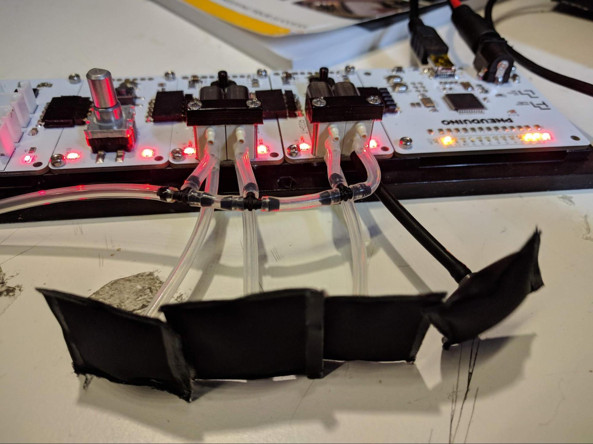

## Wave
**Boards:** Master and at least 2 valve boards
**Tube connections:** Connect all supply ports to the air supply. Connect each output port to an inflatable.

 

In this example, we demonstrate an advanced valve timing sequence. We want each valve to turn on shortly after its neighbor has turned on, thus propagating a "wave" motion down the row of inflatables. The code for this example is extendable to arbitrary numbers of valve boards.

We first designate the length of an entire wave cycle. Every time a new cycle begins, we compute the on and off times for each individual valve, which depends on the valve's position, the time offset between valves, and the duration we want each valve to stay on. This information is stored and used on subsequent `loop()` iterations to open and close valves when appropriate. When the end of the wave cycle occurs, the whole process repeats.

