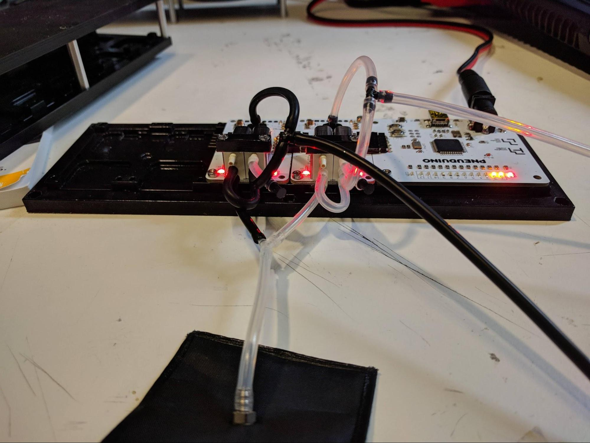

## XOR Gate
**Boards:** Master and two valve boards 
**Tube connections:** Connect tubes as shown below

 

The XOR (exclusive or) gate is a logic gate that takes two inputs, A and B. It outputs a `true` when *exactly* one of A and B are `true`. With pneumatic logic, a high pressure indicates `true` and a low pressure indicates `false`. As Pneuduino valve boards have pressure sensors, they can be programmed to open and close valves depending on an applied pressure. With the right code and tube connections, we can implement pneumatic logic gates.

The XOR gate has the most complex tubing connections of all the logic gates. Using a T connector, connect input A to both the pressure sensor and the left valve's supply port on the first valve board (clear tubing in the upper-right corner of the image). Similarly, connect input B to both the pressure sensor and left valve on the second valve board. For each valve board, connect the left valve's output to the right valve's supply port, and plug the left valve's exhaust with a short length of tubing and a stopper. Lastly, connect both valve boards' right valve output ports to the inflatable via a Y connector.

Run the code, and connect any one of the inputs to the compressed air supply. The output will be `true`, and the inflatable will inflate. However, if both inputs are pressurized, the output will be `false`! The inflatable will deflate.

