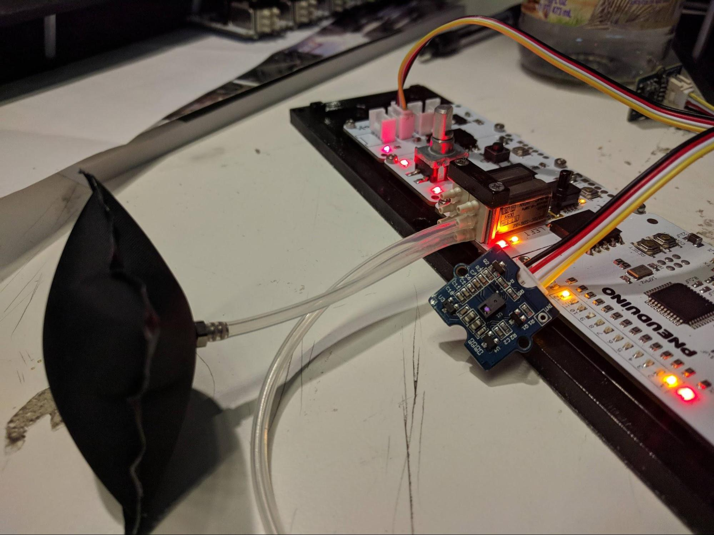

# Pneuduino Examples
The following examples demonstrate the functionality of Pneuduino. For the latest version of this document, see [here](https://docs.google.com/document/d/1lYuiwN-e-qelHg08sa7xSDy6W5l0zNf3X-VFICgQ3M0/edit?usp=sharing).

Table of Contents
=================

   * [Pneuduino Examples](#pneuduino-examples)
      * [Introductory Examples](#introductory-examples)
         * [01 Physical and Virtual Addresses](#01-physical-and-virtual-addresses)
         * [02 Valve On/Off](#02-valve-onoff)
         * [03 Read Pressure](#03-read-pressure)
         * [04 Read Potentiometer and Button](#04-read-potentiometer-and-button)
         * [05 Three-state Operation](#05-three-state-operation)
         * [06 Pressure Regulation](#06-pressure-regulation)
      * [Using Sensors](#using-sensors)
         * [07 I2C Gesture Sensor](#07-i2c-gesture-sensor)
         * [08 I2C Accelerometer and Gyroscope](#08-i2c-accelerometer-and-gyroscope)
         * [09 Serial IO with Computer](#09-serial-io-with-computer)
         * [10 Camera](#10-camera)
      * [Pneumatic Logic and Circuits](#pneumatic-logic-and-circuits)
         * [NOT Gate](#not-gate)
         * [AND Gate](#and-gate)
         * [OR Gate](#or-gate)
         * [XOR Gate](#xor-gate)
      * [Advanced Examples](#advanced-examples)
         * [Haptic](#haptic)
         * [Wave](#wave)
         * [Pressure Regulator v2](#pressure-regulator-v2)

Created by [gh-md-toc](https://github.com/ekalinin/github-markdown-toc)

## Introductory Examples
These examples aim to teach the basic functions of the Pneuduino library.

### 01 Physical and Virtual Addresses
**Boards:** Master, one valve board (preferably with a physical address not equal to 1)
**Tube connections:** None

This example demonstrates the Pneuduino library&#39;s support for physical and virtual addresses. In physical address mode, functions in the library directly take in an extension board&#39;s hardware I2C address. Consequently, replacing an extension board with one of a different address requires a rewrite of the master board&#39;s code. To overcome this inconvenience, the Pneuduino library can map physical addresses to virtual addresses, and function calls automatically convert virtual address inputs to the hardware I2C addresses needed for communication. For any _n_ valve boards with distinct physical addresses, the virtual address system will map them to addresses 1 through _n_, with the lowest physical address mapped to 1, the second lowest mapped to 2, and so on.

Upload the code for this demo to the master board, and observe what occurs. First, the LEDs flash simultaneously, indicating physical address mode. The LED corresponding to the valve board&#39;s physical address remains lit. After a few seconds, the LEDs flash in sequence, indicating virtual address mode. Now, LED 1 will remain lit, as the board has been mapped to virtual address 1. A few seconds later, we switch back to physical addresses, and this process repeats indefinitely.

### 02 Valve On/Off
**Boards:** Master and one valve board
**Tube connections:** None

This example demonstrates how to actuate valves, while also showing the basic form of a Pneuduino program. In `setup()`, we call `begin` to initialize the library and `setAddressMode` to use virtual addresses. We run `update` each `loop()` to allow the library to process changes in state. The demo code here cycles valve states over four time increments of 500ms each.

Each valve on the Pneuduino valve board has three ports. From bottom to top, these are output, supply, and exhaust. Typically, the supply port is connected to a source of compressed air, and the exhaust port is left open to release air into the atmosphere. The `in` function places a valve in its &quot;on&quot; state, where the output port is connected to the supply port, and the exhaust port is blocked. Likewise, the `out` function places a valve in its &quot;off&quot; state, connecting output to exhaust and leaving supply blocked.

### 03 Read Pressure
**Boards:** Master and one valve board
**Tube connections:** Connect the pressure sensor to the compressed air supply as shown

 

Each Pneuduino valve board has a pressure sensor, located behind the valves. Below the pressure sensor, a set of LEDs displays the relative magnitude of the current pressure. This example shows the code necessary to read the sensor. Connect a tube to the pressure sensor as shown, and connect the compressed air supply to the tube. Run the program, and the pressure of the compressed air will be printed to the serial console. Disconnect the pressure sensor, and the pressure should drop.

The pressure sensor outputs an integer from 0 to 255. Atmospheric pressure is typically around 60, and the maximum safe pressure for inflatables is roughly 90. This range is also used as the lower and upper pressure bounds for the indicator LEDs below the pressure sensor.

### 04 Read Potentiometer and Button
**Boards:** Master, valve board, and input board
**Tube connections:** None

The Pneuduino input board contains a potentiometer and a button. This example shows how to read these input devices and use the input data to control valve operation. The potentiometer measures the knob&#39;s angular position, and `readPot()` returns an integer between 0 and 63. The button state can be retrieved with `readButton(0)`, which returns `true` when the button is pressed and `false` otherwise.

In this example, the left valve is pulse-width modulated at a period of 200ms. The potentiometer&#39;s position controls the width of the pulse, adjusting the proportion of time the valve is turned on. The right valve is actuated simply when the button is pressed.

### 05 Three-state Operation
**Boards:** Master, valve board, and input board
**Tube connections:** Connect the valves as shown below

 

This example demonstrates the Pneuduino library&#39;s ability to coordinate the two valves on a board to achieve three states — inflating, deflating, and holding pressure. To start, connect the left valve&#39;s output port to an inflatable. Connect the left valve&#39;s supply port to the compressed air supply. Finally, connect the exhaust ports of the two valves together.

In this example, pressing the button will toggle between the three states. When the inflate function is called, the left valve is turned on to allow compressed air to flow in. When hold is called, the left valve is turned off, blocking new air from coming in, and the right valve is turned on, blocking air from exhausting out. Lastly, when deflate is called, both valves are turned off, allowing air from the inflatable to flow back into the left valve, through the connected exhaust ports, and out the right valve.

### 06 Pressure Regulation
**Boards:** Master, valve board, and input board
**Tube connections:** Connect tubes as shown below

 

The Pneuduino library has the ability to use the onboard pressure sensor as a software pressure regulator, automatically switching the valves to inflate, deflate, or hold as necessary to maintain a pressure. The tube connections for this feature are mostly the same as for the previous example, with the exception that the output tube goes to a T connector. One branch of the T connects to the inflatable, while the other branch connects to the pressure sensor.

When the code is run, the potentiometer&#39;s position is used to set the desired pressure. The Pneuduino library handles the control of the valves automatically. Best results are achieved with a larger inflatable, as a greater volume of air tends to result in a more stable pressure.

## Using Sensors

### 07 I2C Gesture Sensor
**Boards:** Master, valve board, and Grove extension board
**Tube connections:** Connect tubes as shown below

 

Pneuduino has an extension board that allows Grove I2C sensors to be easily incorporated into the system. On the software side, the Pneuduino library can be used together with sensor libraries, allowing sensor data to easily control pneumatic functions. This example shows the use of the Grove Gesture v1.0 sensor to control inflation and deflation.

Plug the gesture sensor into the extension board. Connect the output of the left valve to the inflatable, and connect the supply port to the compressed air supply. When the gesture sensor detects your hand moving towards it, the valve is opened. Air flows into the inflatable, simulating the effect of being pushed by your hand. When your hand moves away from the sensor, air is released.

### 08 I2C Accelerometer and Gyroscope
**Boards:** Master, valve board, and Grove extension board
**Tube connections:** Same as previous example

The Grove 6-axis Accelerometer and Gyroscope is another sensor that can be used to allow physical input to control inflatables. This example shows how to use the sensor and its corresponding library to respond to motion. In this example, the gyroscope readings are used to detect shaking. When a strong motion is detected, the valve is turned on for a moment. Gently tapping the sensor will send a brief pulse of air to the inflatable, and vigorously shaking the sensor will hold the valve open.

### 09 Serial IO with Computer
**Boards:** Master and valve board
**Tube connections:** Same as previous example

Pneuduino can use serial communication to send and receive information with a computer. This functionality is identical to that of Arduino and can be referenced [here](https://www.arduino.cc/reference/en/language/functions/communication/serial/). Serial communication opens up the the possibility to use an entire computer as a sensor device to control Pneuduino.

Run the code on Pneuduino, and open the Arduino serial console. This simple example first prints lines of text, giving usage instructions. Use the `inflate` and `deflate` commands to control Pneuduino&#39;s valves.

## Pneumatic Logic and Circuits
Section TBD

### NOT Gate

### AND Gate

### OR Gate

### XOR Gate

##

## Advanced Examples
More complex code examples combining multiple features

### Haptic
Haptic (vibration) feedback is usually done with rotating motors. However, it is possible to achieve a more natural effect by rapidly inflating and exhausting air.

TBD

### Wave
In this example, we demonstrate how to inflate and deflate a row of inflatables in sequence. This style of motion can be applied to propel &quot;crawling&quot; pneumatic robots.

TBD

### Pressure Regulator v2
In this example, we explore and implement the pressure regulation feature in the Pneuduino library.

TBD

